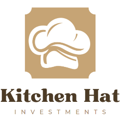
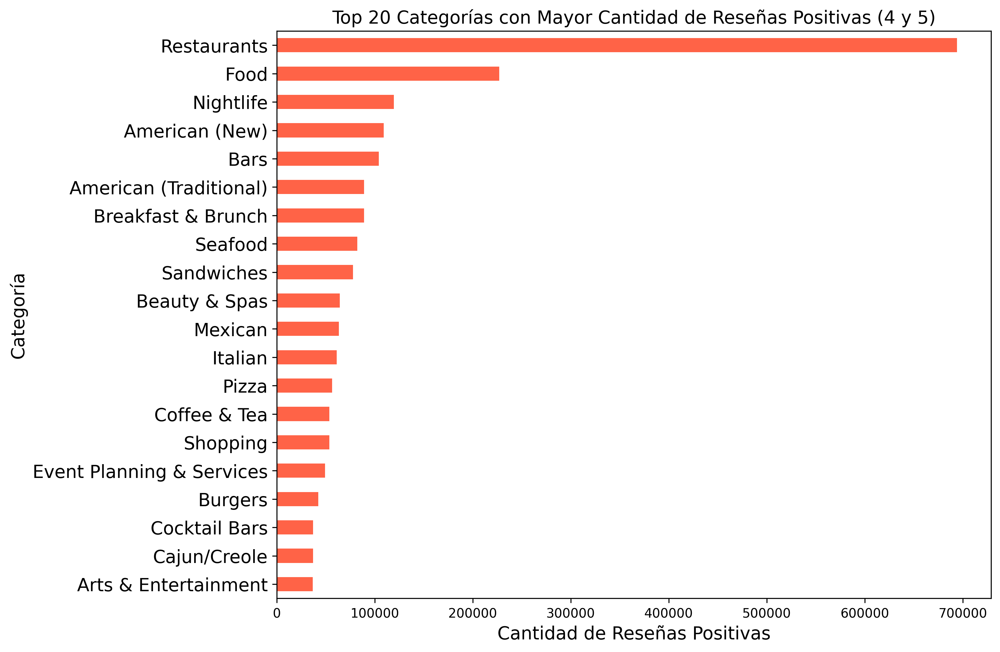
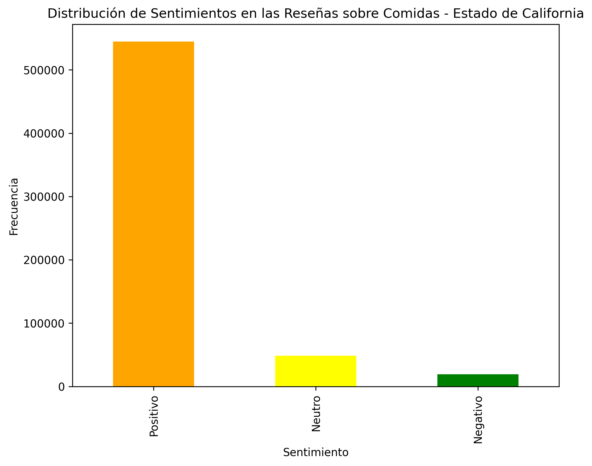
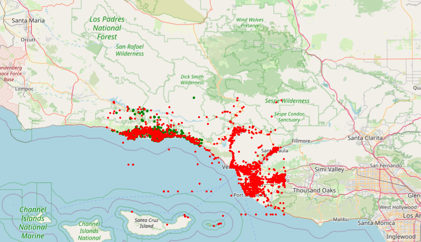
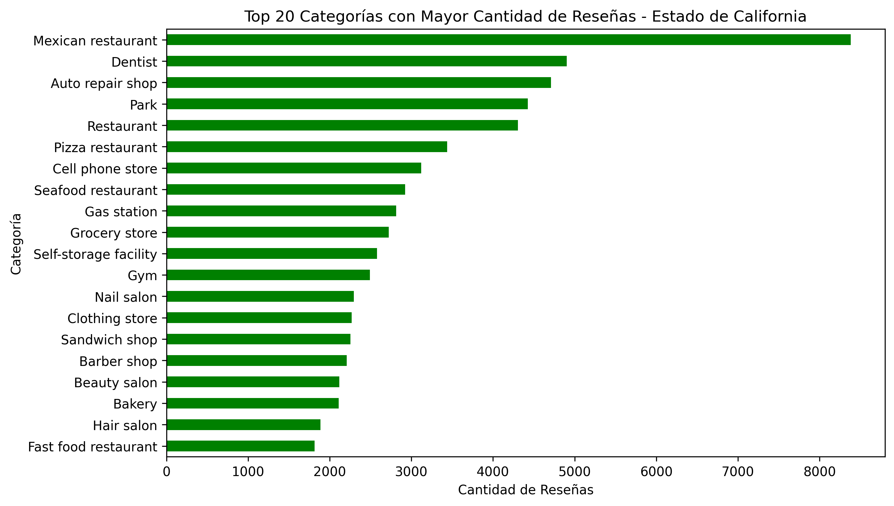
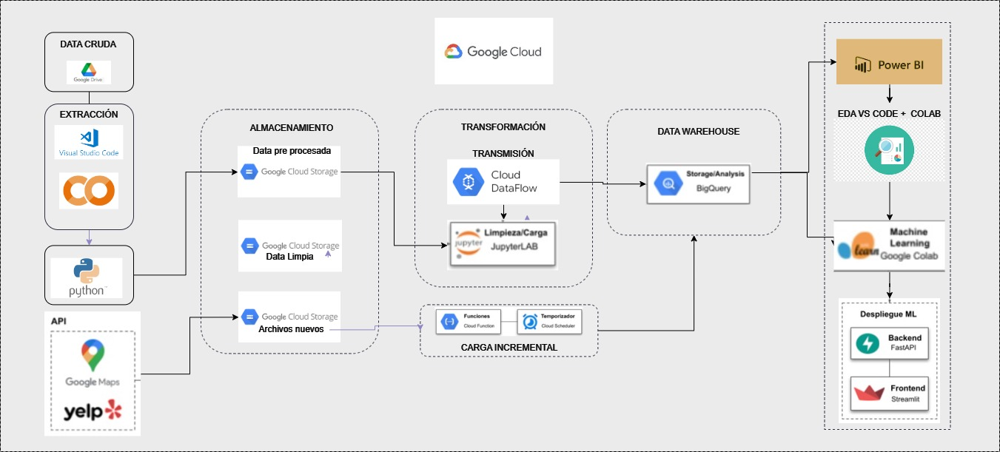

# <h1 align="center">**`YELP & GOOGLE MAPS - REVIEWS AND RECOMMENDATIONS`**</h1>


# Star Tech Data Consulting


En el competitivo mercado de los restaurantes y negocios relacionados con el ocio y turismo en los Estados Unidos, la opinión de los usuarios es una fuente clave de información para el crecimiento y la adaptación de los comercios. Nuestro equipo de profesionales Startech, ha sido contratado por un cliente del sector para realizar un análisis exhaustivo del comportamiento del mercado.


## ​Cliente: Kitechen Hat INVESTMENTS



Nuestro cliente es un grupo empresarial de prestigio en el sector de Restaurantes y rubros afines, con una presencia sólida tanto en el mercado estadounidense como en el internacional. Reconocido por su variedad de marcas y su compromiso con la calidad, se especializa en brindar experiencias gastronómicas excepcionales que combinan tradición e innovación. Con una trayectoria marcada por el crecimiento constante y la satisfacción de sus clientes, la empresa se posiciona como un referente en la creación de ambientes únicos y servicios de primer nivel.

## :white_check_mark: ```Objetivo General del Proyecto ```
Nuestro objetivo es proporcionar insights valiosos mediante el cruce de reseñas de usuarios en plataformas como Yelp y Google Maps, enfocándonos en restaurantes en general, lugares específicos que ofrezcan desayunos-meriendas, almuerzos rápidos como sánguches y también bares para el ocio nocturno


## :white_check_mark: ```Objetivos Específicos ```

- :pushpin: Análisis de Opiniones y Sentimientos: Aplicar técnicas de procesamiento de lenguaje natural (NLP) a las reseñas de Yelp y Google Maps para evaluar la percepción de los clientes sobre los negocios en el ámbito gastronómico en Estados Unidos.
- :pushpin: Identificación de Ubicaciones para Nuevos Negocios: Implementar un modelo de machine learning para determinar las ubicaciones geográficas óptimas para abrir nuevos negocios relacionados con el ámbito gastronómico, tomando en cuenta factores como la cantidad de reseñas positivas y datos demográficos.

- :pushpin: Predicción de Tendencias en Negocios: Emplear algoritmos de machine learning para anticipar qué categorías de negocios dentro del sector experimentarán crecimiento o declive, utilizando datos históricos de reseñas y calificaciones.

- :pushpin: Desarrollo de un Sistema de Recomendación: Crear un sistema de recomendación para usuarios de Yelp y Google Maps, que les sugiera locales gastronómicos, ajustado a sus gustos y experiencias anteriores.


## :white_check_mark: ```Desarrollo del Proyecto```

Para llevar a cabo los objetivos se realizó un análisis prelimiar del comportamiento de los datos provenientes de Yelp y Google Maps. Este análisis se centró especialmente en el las reseñas y ubicaciones de negocios. Se utilizaron diversas técnicas de Análisis Exploratorio de Datos (EDA) para identificar valores faltantes, detectar valores atípicos y registros duplicados, y generar visualizaciones coherentes que faciliten la interpretación de la información.

**A continuación se muestran los resultados más destacados:**

### :globe_with_meridians: Datos de Yelp





### :globe_with_meridians:Datos de Google Maps









## 🏆 Indicadores Claves de Rendimiento (KPIs)


KPI :one: : **Tasa de Crecimiento de Nuevas Reseñas (TCNR)**

Calcula la tasa de aumento en la cantidad de reseñas (de cualquier tipo) en un periodo de tiempo.


  

KPI :two: : **Índice de Oportunidades de Mejora (IOM)**

Representa la proporción de reseñas con calificaciones de 1 o 2 estrellas en relación con el total de reseñas


KPI :three: : **Densidad de Opiniones Favorables (DOF)**

Mide el número de reseñas positivas (4 o 5 estrellas) en un área geográfica específica por kilómetro cuadrado.

KPI :four: : **Índice de Mejora de Rating (IMR)**
Mide el progreso del rating promedio de un local en plataformas como Google Maps y Yelp

## ​Alcances del Proyecto
* Establecemos como negocios objetivo el del  ámbito gastronómico, categorizados como ‘Restaurantes’, ‘Breakfast & Brunch’, ‘Sandwiches’, ‘Coffee & Tea’, ‘Bars’, etc.
* Utilizamos como fuentes de  información las reseñas de Yelp y Google Map, así como también información externa.
* Se tendrán en cuenta las reseñas generadas desde el año 2019 en adelante
* Nos centramos en Estados Unidos, principalmente  en todos los estados que presenten mayor cantidad de reseñas (sin importar el tipo) y mayor valor de PBI per cápita

## ​Stack Tecnológico y Pipeline

