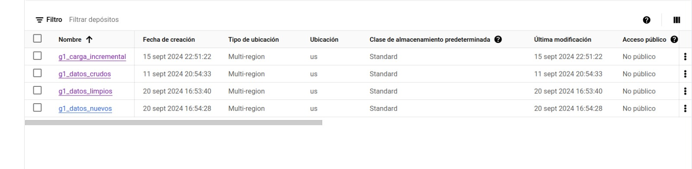
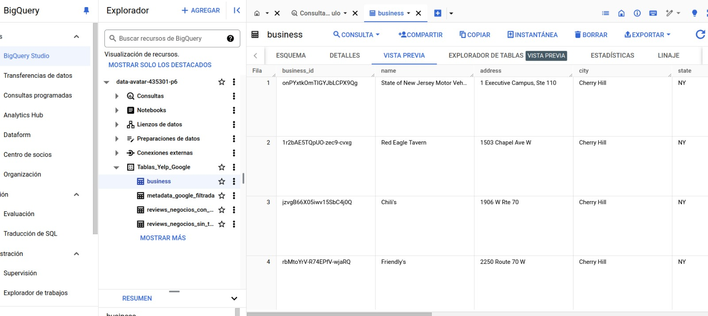
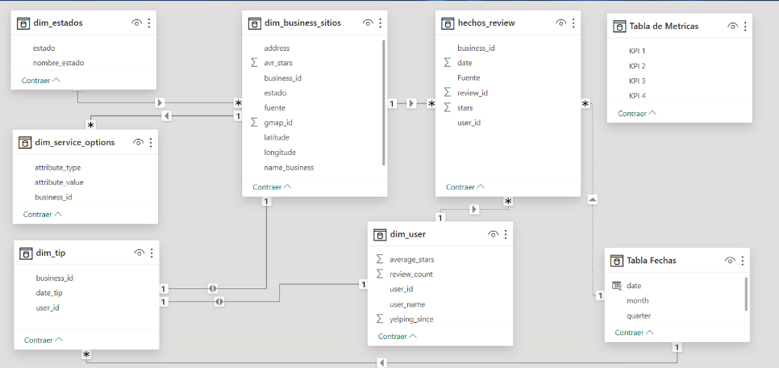
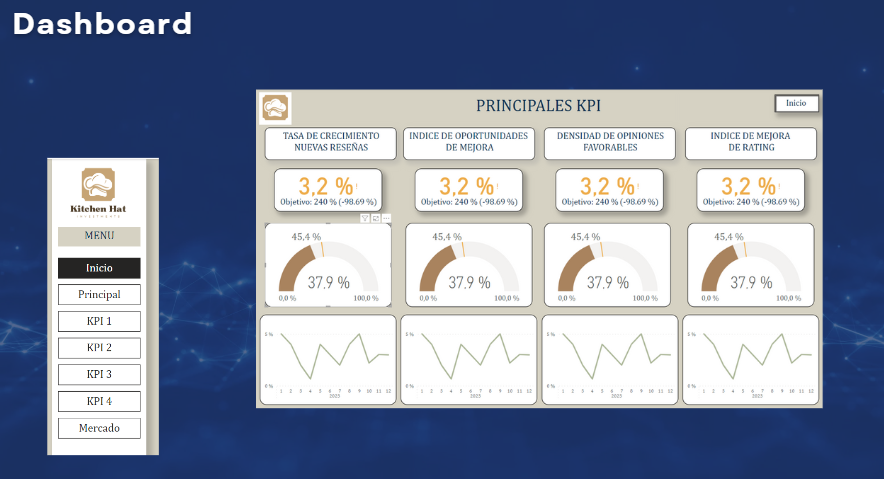

# ProyectoFinal
Proyecto Final Henry
# <h1 align="center">**`YELP & GOOGLE MAPS - REVIEWS AND RECOMMENDATIONS`**</h1>


## ​Sprint 2: Puesta en Marcha del Proyecto


## ✅ ```Data Cruda ```
La fuente de información del proyecto fué proporcionada en Google Drive, los archivos originalmente proporcionado fueron los siguientes: </p>

- 🗂️ Google Maps:</p>
  - **`metadata-sitios`** : La carpeta tiene 11 archivos .json donde se dispone la metadata contiene información del comercio, incluyendo localización, atributos y categorías.</p>
  - **`review-estadosos`** : Los archivos contienen las reviews de los usuarios, uno por cada estado de los EEUU.
- 🗂️ Yelp:</p>
  - **`business`** : Archivo .pkl, que contiene información del comercio, incluyendo localización, atributos y categorías.</p>
  - **`review`** : Archivo .json que contiene las reseñas completas, incluyendo el user_id que escribió el review y el business_id por el cual se escribe la reseña.  </p>
  - **`checkin`** : Archivo .json que contiene los registros en el negocio.</p>
  - **`tips`** : Archivo .json con los Tips (consejos) escritos por el usuario. Los tips son más cortas que las reseñas y tienden a dar sugerencias rápidas.</p>

 

## ✅ ```Data Lake ```

Se utiliza la plataforma Google Cloud, específicamente Cloud Storage para generar los siguientes buckets.
Solo se tomo la información de los estados de Florida (FL), New York (NY), Illinois (IL) y California (CL), para los años de 2016 a 2022. </p>

- 💾 **`Bucket datos_crudos`** : Contiene los datos originales sin procesar. Los datos provienen de las fuentes explicadas anteriormente, y se mantienen en este bucket antes de aplicarles cualquier transformación. </p>
- 💾 **`Bucket datos_limpios`** : Contiene la data ya procesada y normalizada. Este bucket se divide en dos secciones: </p>
  - Datos de Google: Incluye dos tablas:
    - Metadata del negocio: Donde se guarda toda la información sobre los negocios.
    - Reviews de negocios: Donde almaceno las reseñas de los negocios.
      </p>
  - Datos de Yelp: Incluye tres tablas:
    - Business: Contiene la información sobre los negocios de Yelp.
    - Reviews: Donde se almacenan todas las reseñas asociadas a los negocios de Yelp.
    - Users y Tips: Una tabla que contiene información sobre los usuarios y los tips que dejan en la plataforma.

- 💾 **`Bucket datos_nuevos`** : Este es el bucket donde se cargan nuevos archivos de datos. Cuando se suben archivos nuevos a este bucket, una Cloud Function se activa automáticamente, validando que el archivo tenga la estructura correcta y verificando si el archivo ya ha sido procesado. Si todo es correcto, procede a realizar las transformaciones necesarias. </p>
- 💾 **`Bucket carga_incremental`** : Contiene los archivos nuevos normalizados despues decorrerse las funciones de carga incremental </p>
  

  



## ✅ ```Automatización con Cloud Function```

Para automatizar todo el proceso, se creó una ☁️ Cloud Function ☁️ que se ejecuta cuando se suben nuevos archivos al bucket datanueva. 
Esta función:

- Valida la estructura de los datos nuevos. 🆕
- Verifica que los datos no existan previamente en el bucket data limpia. 🔃
- Realiza las transformaciones necesarias🔄 
- Concatena los datos procesados con los que ya están en data limpia. ☑️

Finalmente, los datos transformados se cargan automáticamente en BigQuery. 

## ✅ ```Carga Automática en BigQuery```

Una vez que los datos están procesados y almacenados en data limpia, se envían automáticamente a BigQuery, donde se han creado las siguientes tablas para almacenar los datos de manera estructurada y facilitar su análisis posterior:

**Para los datos de Google:**
- Tabla de **`Metadata del negocio:`** Guarda toda la información relevante sobre los negocios.
- Tabla de **`Reviews de negocios:`** Esta tabla almacena todas las reseñas de los negocios procesados.

**Para los datos de Yelp:** 
- Tabla de **`Business:`** Contiene los datos de los negocios extraídos de Yelp.
- Tabla de **`Reviews:`** Almacena las reseñas asociadas a los negocios.
- Tabla de **`Users y Tips:`** Esta tabla contiene información sobre los usuarios y los tips que dejan en la plataforma.

## ✅ ```Data Warehouse```
</p>
De esta manera, se ha automatizado todo el flujo de trabajo ETL: desde la carga de archivos en Google Cloud Storage, la transformación de los datos mediante Cloud Functions, hasta la carga final en BigQuery, desde donde se pueden realizar consultas y análisis de forma rápida y eficiente.





> **Nota:** Todo este flujo sigue el proceso ETL:  
> - **Extracción (Extract):** Los datos se extraen desde las fuentes originales, como Google Maps y Yelp a través de una api, y se almacenan en el bucket de datos crudos.  
> - **Transformación (Transform):** Las Cloud Functions validan, limpian y normalizan los datos automáticamente, y los colocan en los buckets de datos limpios o carga incremental según sea necesario.  
> - **Carga (Load):** Los datos limpios se cargan automáticamente en BigQuery para análisis y consultas.
## ✅ ```Relacionamiento de Tablas```





## ✅ ```Dashboard Mockup```
  
El dashboard se realizará en 📊 `Power BI` 📊 y tendrá el siguiente esquema:

**1. Página de Inicio:** Presenta el menú principal del Dashboard con sus respectivos links de acceso a cada página. </p>

**2. Resumen:** Presenta la información de los 4 principales KPI's asi: 
  - Valor Actual y % de cumplimiento de la meta 🎯.
  - Valor absoluto del indicador y distancia de este con el valor meta. Grafica de velocimetro 🏎️ .
  - Gráfico de tendencia 📉.

**3. KPI's:** Cada KPI tendrá una página en la cual se representa una grafica de barras con sus valores más recientes y diferentes objetos para contextualizar. Tambien se incluyen indicadores asociados, por ejemplo, para el KPI 2, Indice de oportunidades de Mejora, el cual estám dado por el número de calificaciones entre ⭐ y ⭐⭐ dividido el total de calificaciones, se incluirá tambien el indice para las calificaciones neutras (⭐⭐⭐) y el indice de calificaciones positivas (⭐⭐⭐⭐ y ⭐⭐⭐⭐⭐).

**4. Mercado:** Contiene un contexto general del mercado gastronómico en los 4 estados 🗺️ seleccionados. 
  
 
  </p>

  ## ✅ ```Sistema de Recomendación```

Para el modelo de recomendación se utilizará Machine Learning, especificamente el algoritmo de Similitud Del Coceno.

La similitud del :atom: coseno :atom: mide qué tan similares son dos elementos basándose en sus características. En lugar de mirar las diferencias o similitudes directas entre características, se mide el ángulo entre dos vectores que las representan. 
Si el ángulo es pequeño (coseno cercano a 1), los elementos son muy similares; si el ángulo es grande (coseno cercano a 0), los elementos son menos similares.

  

